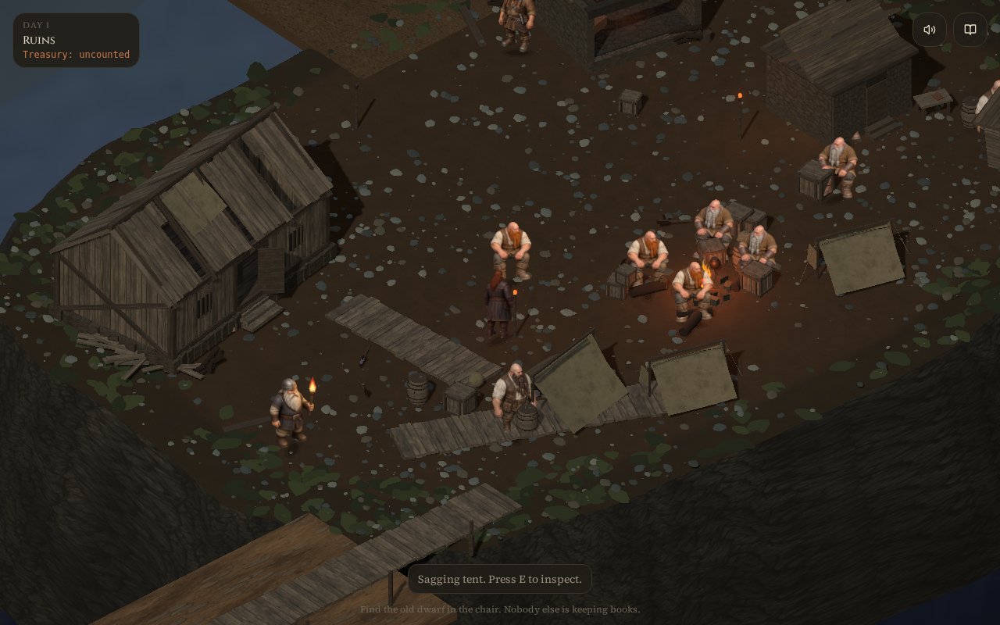

# Reference art pass

This is an in-progress asset rebuild toward the supplied Dwarf Lord camp image. It is not a completed visual match.

## Detailed dwarf follow-up — 2026-09-08

Three new high-resolution characters now replace the seated workers and unhelmeted standing laborer: ginger and silver seated workers in a 1536×1024 two-cell atlas, plus a 1024×1536 standing laborer. Both files have verified alpha transparency (about 48% transparent pixels). Seated figures are 41% taller and standing figures 26% taller than the first pass. Existing player direction/gait frames and named specialist art are retained.

Timber UVs now follow board length, the roof canvas patch sits above the boards, and bump relief plus ambient fill make the surfaces more readable. Asset origins and atlas layout are documented in `public/sprites/GENERATED-ASSETS.md`.

## Implemented

- Timber hall built from individual boards, exposed rafters, cross braces, stone footings, open doorway and a canvas patch. Roof damage still responds to the existing repair condition.
- Three-dimensional sagging tents with poles, ropes and bedding; framed wooden crates and curved stave barrels; low uneven boardwalk planks.
- Continuous fractured cliff geometry replacing the oversized boulder perimeter, plus instanced gravel and moss. Gravel is smaller near the boardwalk and fire.
- Lower, broader cookfire with horizontal logs. Readable weathered materials and lighter dusk fill.
- Viewport-relative orthographic zoom and larger detailed character sprites. The new-game starting view is inside the camp; existing simulation coordinates and interactions are preserved.

## Validation

- `npm run typecheck`
- `npm test` — 143 tests passed
- `npm run build:pages`
- `git diff --check`
- `node scripts/reference-visual-check.mjs` — captures the production Pages build, asserts player movement and the Borrin dialogue interaction, and checks for browser runtime errors.

To reproduce the browser check, serve `.output/public` at `/Dwarf-Lord/` on port 8081 after building. Override `REVIEW_URL` and `REVIEW_OUTPUT` as needed. Chromium must be installed with `npx playwright install --with-deps chromium`.

The bundled web-game harness additionally reports the existing recoverable React #418 static-shell hydration message (the expected mismatch is documented in `src/client.tsx`). The dedicated gameplay check records no uncaught exceptions; movement and Borrin dialogue pass.

## Remaining art work

The camp still has the game's wider layout and secondary buildings, rather than the reference's compact single-hall composition. The seated and generic standing workers now use new detailed art; player directional animation and specialist variants still need a coherent replacement set. Secondary structures, cliff texture scale, lighting balance and hardware performance need further review before calling this reference-quality or merging it as final art.
